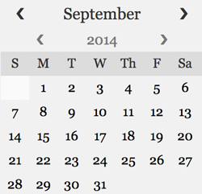
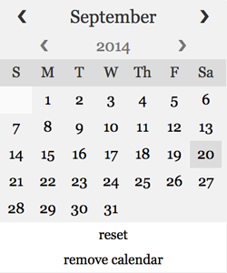

## Highsmith Calendar Picker

Highsmith is a simple calendar picker.  It has several customization options, and does not require jQuery or any additional CSS.  Simply attach Highsmith to an input/element.  When you select a date on the calendar, its value will be placed into your input/element.

## Invoking Highsmith

To acheive the default Highsmith calendar, simply invoke Highsmith on your desired input.

	// html
	<input type="text" id="default-cal"/>

	// js
	var defaultCal = new Highsmith('default-cal');

## Customizing Highsmith

Highsmith accepts several options for customization.  The full range of options is at the bottom of this document.  It holds a default options object, which can be updated in one of two ways:

###### Custom options at initialization
	var options = {
		resetDateButton: true, // allows user to reset to current date
		killButton: true // allows user to kill Highsmith instance.
	};
	var cal = new Highsmith('my-cal', options);

###### Custom options on existing calendar
	var options = {
		resetDateButton: true,
		killButton: true
	};
	defaultCal.updateOptions(options);

This calendar will be the result of the above customizations

## All Options
Highsmith comes with default options.  Any of these can be customized by sending a full or partial options object to your Highsmith instance.  Note: sending

    format: 'mdy',  // accepts mdy, ydm and dmy
    killButton: false, // kills calendar
    resetDateButton: false, // resets calendar to current date
    disableOffClicker: false,  // calendar dissapears on offclick

    style: {

      disable: false, // Disables styling all together if true

      month: {

          bgColor: '#F1F1F1',
          color: '#333',
          fontFamily: false,
          fontSize: '16px',
          labelSize: '80%',
          padding: '4px',
          toggleSize: '10%'

      },

      year: {

          bgColor: '#F1F1F1',
          color: '#777',
          fontFamily: false,
          fontSize: '14px',
          labelSize: '60%',
          padding: '4px',
          toggleSize: '10%'

      },

      days: {

          bgColor: '#F1F1F1',
          color: '#333',
          fontFamily: false,
          fontSize: '13px',
          height: '16px',
          legendBgColor: '#DCDCDC',
          legendColor: '#333',
          nullBgColor: '#FAFAFA',
          padding: '4px',
          width: '20px'

      },

      globals: {
          fontFamily: 'Georgia, serif',
          bgColor: '#FFFFFF',
          border: '1px solid #F1F1F1',
          borderRadius: '2px',
          downArrowIcon: '&#10095;',
          upArrowIcon: '&#10094;',
          width: '200px'

      },

      buttons: {
          fontSize: '12px',
          padding: '4px'
      }

    }

## Classes for styling

Highsmith can receive custom styling.  Here are a list of classes you can use to style your calendar.

	// To customize Highsmith styling completely, pass the
	// { style: {disable: true }} flag with your options, and use
	// the following classes.

    highsmithCal

    highsmithCal--month

    highsmithCal--month__label

    highsmithCal--month__increment

    highsmithCal--month__decrement

    highsmithCal--year

    highsmithCal--year__label

    highsmithCal--year__increment

    highsmithCal--year__decrement

    highsmithCal--daysLegend

    highsmithCal--daysLegend__label

    highsmithCal--dayHolder

    highsmithCal--dayHolder__nullLabel

    highsmithCal--dayHolder__label

    highsmithCal--killButton

    highsmithCal--resetButton
